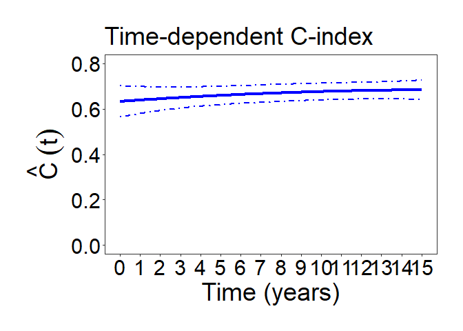

# TimeDependentCIndex

<!-- badges: start -->
<!-- badges: end -->

This contains R-code and example data for the statistical method for
evaluating a time-dependent C-index for recurent event data, described
in:“Wang J, Jiang X, Ning J. Evaluating dynamic and predictive
discrimination for recurrent event models: use of a time-dependent
C-index. Under Revision.”

## Installation

You can install the development version of TimeDependentCIndex from
[GitHub](https://github.com/) with:

``` r
library(devtools)
devtools::install_github("lilyxj91/TimeDependentCIndex",force = TRUE)
```

## Example

This is a basic example which shows you how to solve a common problem:

``` r
library(TimeDependentCIndex)

### Define the parameters
n.var<-3  ## number of predictors
B<-200  ## number of perturbations
train.data = TrainData
validate.data = ValidateData

### Calculate alpha values and perturbation alpha values
results<-TimeDependentCIndex(train.data,validate.data,n.var,B)
```



``` r
alpha<-results[[1]] ## alpha estimation
alpha.pb<-results[[2]] ## alpha perturbation results
alpha
#> [1]  0.70346819  0.11383066 -0.04545526
```

``` r

head(train.data)
#>   id         t t.obs indi Num X1         X2        X3
#> 1  1  4.410887    15    0   6  1 -0.3020925 0.4300591
#> 2  1  5.158452    15    0   6  1 -0.3020925 0.4300591
#> 3  1  6.274329    15    0   6  1 -0.3020925 0.4300591
#> 4  1  6.740334    15    0   6  1 -0.3020925 0.4300591
#> 5  1  8.379347    15    0   6  1 -0.3020925 0.4300591
#> 6  1 13.156354    15    0   6  1 -0.3020925 0.4300591
# id is the subject ID; 
# t is the time to recurrent events;
# t.obs is the censoring time;
# indi is the censoring indicator (1-observed; 0-censored);
# Num is the number of recurrent events;
# X1, X2 and X3 are three predictors.  
# 
# Please arrange your data into this format with the same column names.  
```
